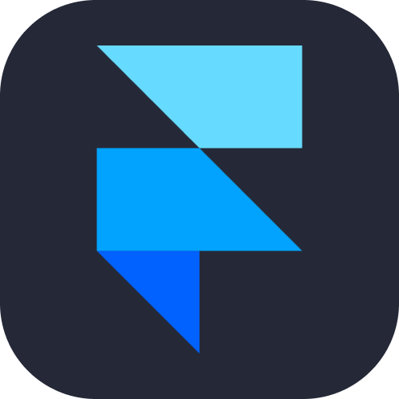
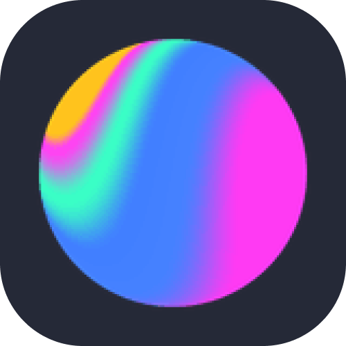
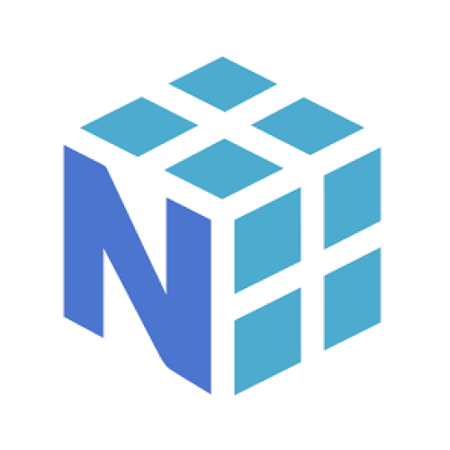

# Welcome to My GitHub Profile! 👋

### Hi, I'm [Shravan Nander Pandala](https://github.com/Unknown-Geek)
I'm passionate about coding, learning, and designing.  
Always open for new projects. Let's Connect!!

---
## 🎧 Spotify Status

## 📊 GitHub Stats

### Overall Stats:
 

###

    <!---->
    
    &nbsp;
    

### Top Languages:

    

    
    

### WakaTime Stats:

<!--START_SECTION:waka-->
<!--END_SECTION:waka-->
---

## 📌 Pinned Repositories

---

## 🌐 Socials:
 

## 💻 Tech Stack:

  
  
  
  
  
  
  
  
  
  
     
  
  
  
  
  
  
  
  
  
  
     
  
  
  
  
  
  
  
  
  
  
      
  
  
  
  
  
  
  
  
  
  

## 🔝 Top Contributed Repo

---

## 💰 You can help me by Donating
 

---

