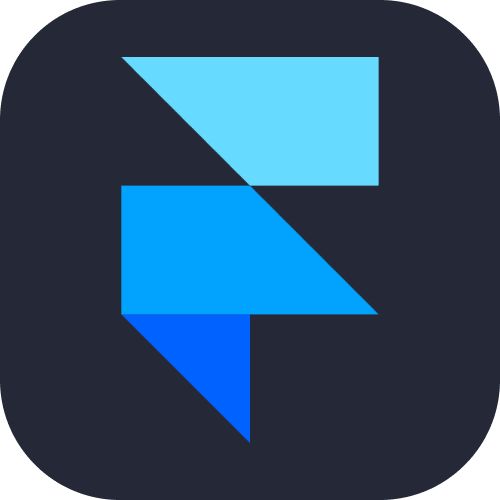
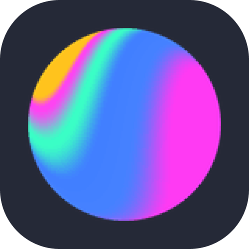
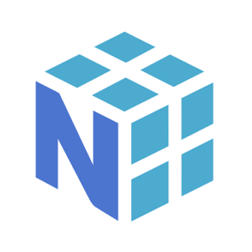

<!--

I'm passionate about coding, learning, and designing. 
Always open for new projects. Let's Connect!!
-->

 
 

## Spotify Status

## GitHub Stats & Activity

### Overall Stats:

 

 

  

 

 

### Activity Graph:

### Top Languages:

  
  

### WakaTime Stats:

## Pinned Repositories

## Tech Stack:

  
  
    
  
  &nbsp;
  &nbsp;  
  
  &nbsp;
  &nbsp;
  &nbsp;
  &nbsp;

## Socials & Contact:

## Support

---

  
  
  

